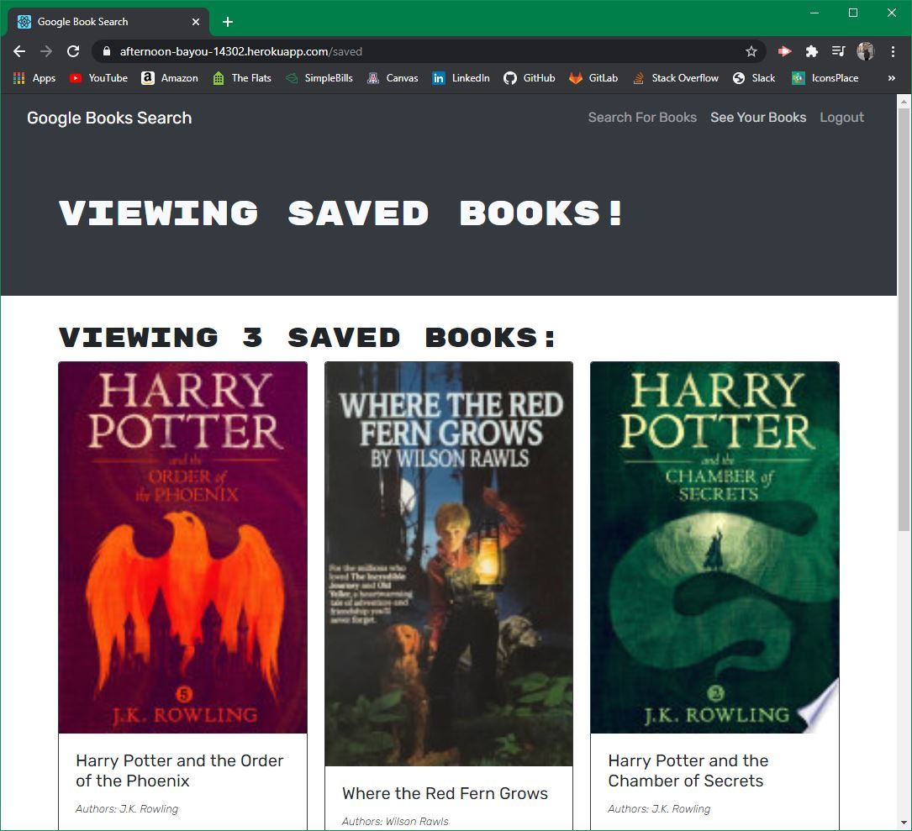

## Book Search Engine

## Description
Book Search Engine allows users to search for books and recieve further information about the novel. If users sign up for an account, they can also save books for future reference. The application utilizes JSON Web Tokens to save login credentials and then allows users to save books to their saved list.<br>Deployed Application: https://afternoon-bayou-14302.herokuapp.com/

  ##
  

  ## Usage
  Navigate to root directory and run:
  ```
  npm start
  ```

  ## Technologies Used
* React JS
* GraphQL
* JavaScript
* Apollo
* Heroku
* Node JS 
* Concurrently
* MongoDB
* Mongoose
* Express

## Contributors
Joseph DeFelice

## Contact
If you have any questions, contact the author directly at defelicejoseph@outlook.com.